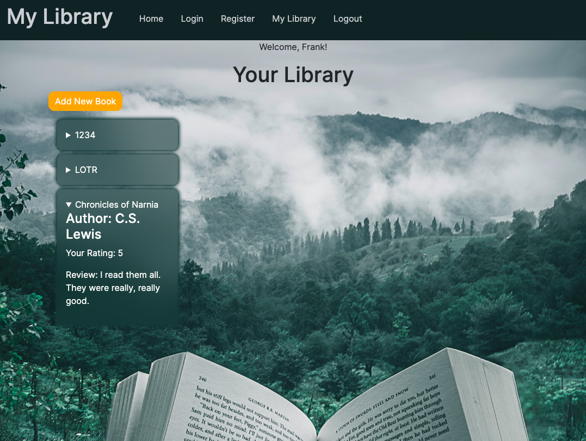

# Library Server

## Project Description

Library Server is the REST API companion to our library manager app (catchy name coming soon), which allows users to build and maintain their personal digital bookshelves. With this API, users can keep track of the books they read, rate them, add reviews, and more.

### Key Features:

- **MongoDB Integration**: This API is seamlessly connected to our MongoDB database. It manages separate collections for registered users and libraries. When a user adds their first book, a library document is automatically created and linked to their account.

- **User Account Management**: Users can interact with their accounts through various endpoints, including:
  - Getting account data (GET /api/users/me)
  - Registering for a new account (POST /api/users)
  - Updating their account information (PUT /api/users/me)
  - Logging in (POST /api/users/login)

- **Library Management**: The Library endpoints allow users to:
  - Retrieve specific books from their library (GET /api/library/:id/books/:bookId)
  - Fetch all books from their library (GET /api/library/:id/books)
  - Add new books to their library (POST /api/library/:id/books)
  - Update book details (PUT /api/library/:id/books/:bookId)
  - Delete specific books (DELETE /api/library/:id/books/:bookId)
  - Remove their entire library (DELETE /api/library/:id)

## Try It Out

To explore the Library Server API and integrate it into your library manager app, visit the [Library Manager GitHub Repository](https://library-manager-gamma.vercel.app/my-library). Stay tuned for the catchy name!

For more detailed documentation on API usage, please refer to our Wiki.
